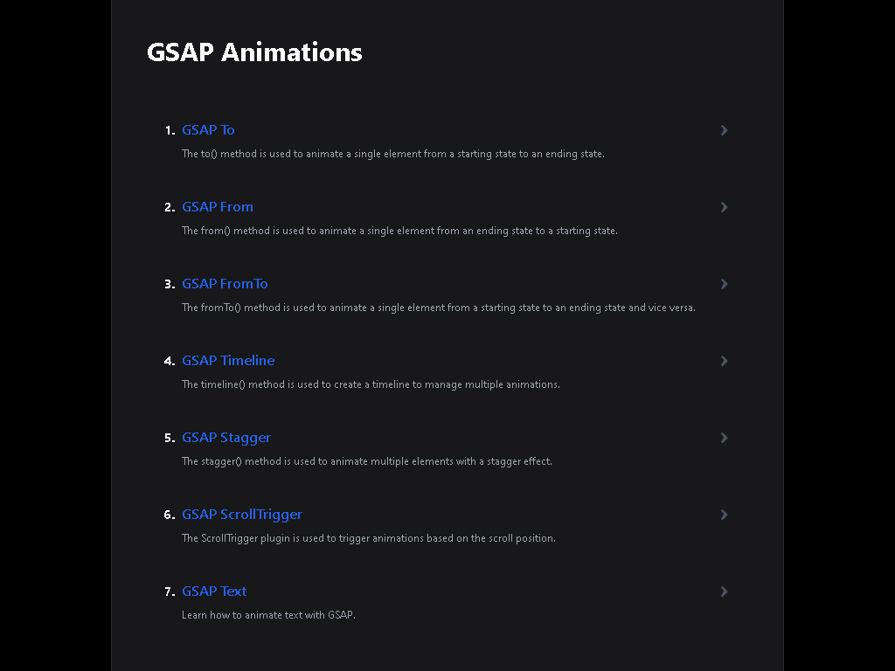

# GSAP Animations

## Descripción

Documentación que muestra los diferentes tipos de animaciones que se pueden hacer con GSAP Hecha En React.js Y Tailwind CSS.

---

## Vista En Versión Desktop

## Vista En Versión Mobile

---

## Enlace A La Aplicación

[GSAP Animations](https://gsap-doc-ui.netlify.app/)

---

## Hecho con

- [React](https://react.dev/) - JS library
- [Tailwind CSS](https://tailwindcss.com/) - For Styles
- [GSAP](https://gsap.com/) - For Animations

---

## Comandos

- npm run dev
- npm run build
- npm run preview

---

## Dependencias De Desarrollo

- autoprefixer
- gsap
- postcss
- tailwindcss

---

## Autor

- Website - [Axe10rellana](https://axe10rellana.github.io/portafolio/portafolio/)
